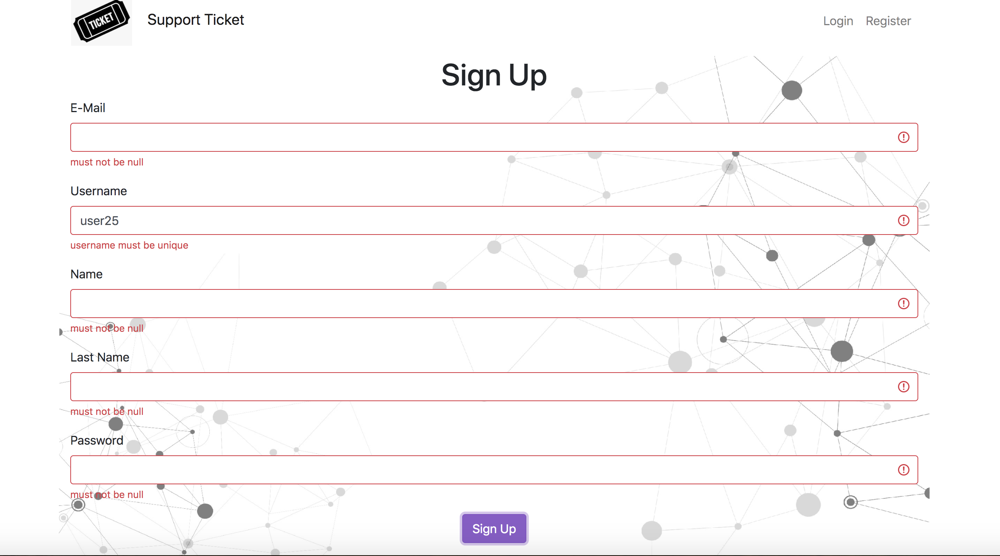

# Ticket-App-with-Spring-Boot-and-React

Gereksinimler:
--
* JDK 11 kurulu olmalı : http://jdk.java.net/java-se-ri/11 (OpenJDK) İşletim sistemininize uygun indirme bağlantısını kullanarak bilgisayarınıza JDK 11 kurunuz. Ayrıca terminalden jar dosyası çalıştırılmak istenirse ortam değişkeni (PATH) ayarlanmış olmalı.

* Derleme için Maven kurulu olmalıdır. 

    İndirme Bağlantısı: https://maven.apache.org/download.cgi
    
    https://maven.apache.org/install.html adresinden kurulum adımlarını inceleyebilirsiniz. 

    Maven ortam değişkenlerinde (PATH) kayıtlı olmalıdır. 
    Bkz: Path ayarlama
  
---

* Kurulumlardan sonra:

    Terminal üzerinde: 

        git clone https://github.com/furkaninch/Ticket-App-with-Spring-Boot-and-React.git
    (Bu komut için Git Kurulu olmalıdır)

    İlgili Klasöre giriniz ve react dosyasini acarak oncelikle gerekli dosyalari

        cd ticket-app
        npm install
    komutlari ile indiriniz kurulum tamamlandiktan sonra 

        npm start
    komutu ile uygulamayi baslatiniz

    Sonrasinda IDE uzerinde 
    
        ticket-spring

     klasorunu acarak server'i baslatiniz. 

    React uzerinde proxy icin 8080 portu kullanilmistir tum API requestler bu porta gitmektedir lutfen serverin bu portta calistigindan emin olunuz.

    
---
---        

Uygulama özellikleri:
--

* Register (Spring Security)

* Kullanicilarin kayit formunda validationlar yapilmis olup her kullanicinin bir unique username'e sahip olmasi icin ayrica bir annotaion yazilmistir.

* Login (Spring Security)

* Ticket liste ekranı

* Ticket oluşturma ve güncelleme form sayfasi

* Ticket oluşturma ve güncelleme ekranında Durum ve Kategoriler aşağıda belirtilen API’lardan alınmistir;
* Kategori API: 
        https://604938a3fb5dcc0017969c2d.mockapi.io/api/category

* Durum API: https://604938a3fb5dcc0017969c2d.mockapi.io/api/status

* Kullanicilar sadece kendi paylastiklari ticketlar uzerinde guncelleme ve silme islemi yapabilirler. Diger kullanicilarin paylastiklari ticketlar uzerinde islem yapamazlar.

* Ticket listeleri sayfa seklindedir ve assagida bulunan sonraki ve onceki butonlari sayesinde sayfalar degistirilebilir. Ilk sayfada onceki son sayfada sonraki butonu de-aktive olur.

* Kullanicinin login olup olmamasi durumu react redux ile state'de tutulur ve sayfalar arasinda birbirine paslanir.

* Yeni bir liste elemani eklenirken basarili durumda kullaniciya bununla ilgili bir success alert gosterilir kullanici yeni bir input girene kadar bu alert sayfada kalir yeni bir input girilir ise bu alert sayfadan kaldirilir.

---
Kod standartlarına uygun yazılım geliştirilmiştir:

* OOP odaklı Katmanlı mimari kullanılmıştır. 

        Data erişim katmanı 
        Servis Katmanı
        Sunum Katmanı
        Interface'ler kullanılmıştır.

---

Kullanılan Teknoloji & Yazılımlar
--
Spring Boot, Spring Security, JPA-Hibernate, Maven, HTML, CSS, JS, React.js, Axios, Bootstrap, Lombok, Redux, Hooks, React-Router

---

NOTLAR
--
Bazı IDE'lerde lombok plugini problem çıkarmaktadır. Getter ve setter gibi metodlar görünmezse bu problem var demektir. İlgili IDE'ye lombok plugini yüklenmeli.

---
Proje Ekran Goruntuleri
---
* Homepage

* My Tickets

* Login Page

* Sign Up Page

* Create Ticket Success Case

* Create Ticket Failed Case

* Update Ticket Page

* Update Button Hover

* Delete Button Hover

